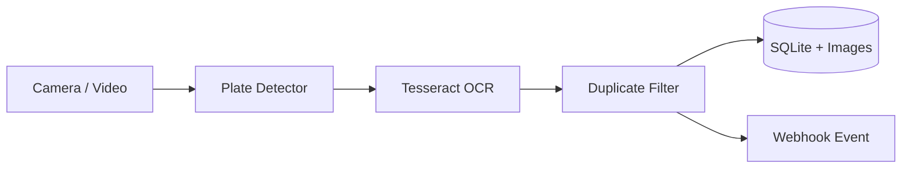

# Jetson Edge Action — ANPR

Real-time Automatic Number Plate Recognition for NVIDIA Jetson. The pipeline reads a USB/CSI camera or video, detects plate regions, runs OCR locally, suppresses duplicate reads, stores events in SQLite, saves evidence images, and can send JSON events to an external controller or dashboard.

## Architecture



## Features

- Fully local Edge processing; cloud connection is not required
- USB camera, CSI/GStreamer-compatible camera, RTSP, or video-file input
- ONNX detector through OpenCV DNN, with contour mode for setup testing
- Configurable OCR threshold and duplicate cooldown
- SQLite event history and optional plate snapshots
- Optional webhook integration with a controller, SCADA, or dashboard

## Jetson setup

Tested as a Python-first reference design for JetPack 6. Use the OpenCV build supplied with JetPack when possible.

```bash
sudo apt update
sudo apt install -y python3-pip python3-venv tesseract-ocr libtesseract-dev
python3 -m venv .venv --system-site-packages
source .venv/bin/activate
pip install -r requirements.txt
cp config.example.yaml config.yaml
python3 main.py --config config.yaml
```

Press `q` or `Esc` to stop.

## Production detector

Place a YOLO-format license-plate detector exported to ONNX at `models/license_plate_detector.onnx`, then set:

```yaml
detector:
  mode: onnx
  model_path: models/license_plate_detector.onnx
  confidence: 0.45
```

Model weights are deliberately not committed because their licenses and target countries vary. Validate accuracy using local Saudi plate samples before field deployment. TensorRT conversion can be added later for maximum Jetson performance.

## Camera sources

Set `source` in `config.yaml`:

- `0` for the first USB camera
- `/path/video.mp4` for a file
- `rtsp://...` for an RTSP stream
- a GStreamer pipeline string for Jetson CSI cameras

## Event payload

When `events.webhook_url` is set, each accepted result sends:

```json
{
  "plate": "ABC123",
  "confidence": 0.91,
  "timestamp": 1788811200.0,
  "image_path": "data/captures/ABC123_1788811200.jpg"
}
```

## Test

```bash
python3 -m unittest discover -s tests -v
```

## Important

This is an engineering reference project, not a certified enforcement product. Follow applicable privacy, cybersecurity, data-retention, and authority requirements before deployment.

## License

MIT © 2026 Murad Hijjawi
